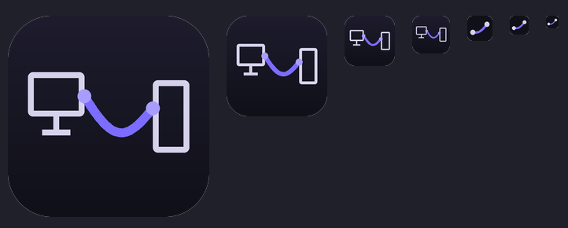
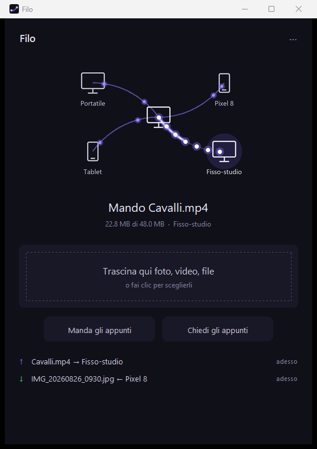

<h1 align="center">Filo — Android</h1>

<p align="center">
  <b>Direct transfer of files, images and text between devices on a local network.</b><br>
  No external service, no account: devices talk to each other<br>
  over the local network or through a USB cable.
</p>

<p align="center">
  <a href="https://github.com/diberardinoleonardo55-coder/filo-android/releases/tag/apk-latest">
    <b>Download the APK</b>
  </a>
  &nbsp;·&nbsp;
  <a href="https://github.com/diberardinoleonardo55-coder/filo-pc">Windows version</a>
</p>

<p align="center">
  
</p>

---

## Overview

The Android application of the
**[filo-pc](https://github.com/diberardinoleonardo55-coder/filo-pc)** project.
The two implementations speak the same protocol and have no distinct roles:
every device both accepts connections and makes them, so it can be paired with
a computer, with another Android device, or with several devices at once,
picking the recipient each time.

| Direction | How |
|---|---|
| sending files | *Share → Filo* from any application, or *Send files* |
| sending text | *Send clipboard*, or the quick-settings tile |
| receiving files | saved automatically: images in `Pictures/Filo`, video in `Movies/Filo`, everything else in `Download/Filo` |
| receiving text | notification with a **Copy** action |
| clipboard request | notification with a **Send** action |

Kotlin and Jetpack Compose. No networking library: `HttpsURLConnection`,
`SSLServerSocket` and `DatagramSocket`.

The interface is in English, with Italian selectable from the menu; see
[Language](#language).

---

## Constellation view

At the top of the screen the local device sits at the centre, the paired
devices around it, drawn as a monitor or a phone according to their kind; a
thread runs from each of them to the centre. The view is the same as in the
Windows implementation:

<p align="center">
  
</p>

<p align="center"><i>(image taken from the Windows version; on Android the layout is vertical)</i></p>

| State of the thread | Meaning |
|---|---|
| dim, with a wide bow | device unreachable |
| lit, with a moving dot | reachable and idle |
| taut, lit in proportion | transfer in progress |

The direction of movement shows the direction of the transfer; each thread
carries its own progress, so several transfers are visible at once.

Touching a figure or its thread selects the recipient, whose name then appears
in the labels of the buttons below.

---

## Language

The interface starts in English. Italian is selectable from **⋯ → Language**,
and the choice is stored in the preferences, so it survives a restart.

Source strings are English and double as the lookup key, so a missing
translation leaves the English sentence rather than a hole. The compiler cannot
catch a mistyped key — `t()` accepts any string and returns the key when it
finds nothing — so `strumenti/controlla_testi.py` compares the keys used in the
sources against the dictionary, and runs on every build.

---

## The server side

**[`Servitore.kt`](app/src/main/java/it/leo/filo/Servitore.kt)** implements the
same eight endpoints as the Python side, so a caller cannot tell what kind of
device is answering.

```
GET  /chi              POST /abbina           GET  /eventi?dopo=N
GET  /scarica/<id>     POST /consegnato/<id>  POST /carica
POST /appunti          POST /prendi-appunti
```

The HTTP implementation is deliberately minimal: requests come from one known
protocol and every response closes the connection (`Connection: close`), which
avoids having to handle reuse.

**[`Identita.kt`](app/src/main/java/it/leo/filo/Identita.kt)** produces the
certificate. A key created in the AndroidKeyStore is generated together with a
self-signed certificate, enough for the purpose without a crypto dependency;
the private key is not exportable and is used only for signing.

If generation fails the application still works as a client, and the pairing
screen says so, pointing out that pairing must be started from the other
device.

---

## Design decisions

**1. Requests with `dopo=0`.**
Entries already collected are removed by the sender on confirmation, so no
counter has to be kept and restarting a device loses nothing. When a pick-up
fails the entry is offered again immediately: the five-second pause in
`PonteService` keeps that from spinning.

**2. Verification by fingerprint.**
Host name checking is off because the certificate carries `Filo` and not the
address, which changes. Two fingerprints are accepted, the declared one and the
one observed on the first connection: an intermediary that inspects TLS traffic
presents a regenerated certificate.

**3. The address does not identify the device.**
When a device stops answering, discovery runs again and the first one with a
matching fingerprint is accepted, updating the stored address.

**4. Loopback only for devices of type PC.**
A computer can expose its port on the device through `adb reverse`; for an
Android device 127.0.0.1 would be itself.

---

## Clipboard access

Since Android 10 an application in the background can neither read nor write
the clipboard: it is a system restriction with no permission attached, and it
applies to every application that is not the default keyboard.

[`AppuntiActivity`](app/src/main/java/it/leo/filo/AppuntiActivity.kt) is an
activity with no interface that is opened, takes focus, operates on the
clipboard and finishes. It is used by the quick-settings tile and by the
notification actions. The work happens in `onWindowFocusChanged` and not in
`onResume`, because focus arrives later.

---

## Technical notes

<details>
<summary><b>Permissions on shared Uris</b></summary>

<br>

The read permission granted by the sharing application follows `intent.data`
and the `ClipData`, not the extras: passing the Uris in the extras alone leaves
the content unreadable. See `PonteService.mandaRoba()`.

</details>

<details>
<summary><b><code>startActivityAndCollapse(Intent)</code></b></summary>

<br>

From API 34 it throws: the `PendingIntent` variant must be used instead. See
`Riquadro.onClick()`.

</details>

<details>
<summary><b>Sending large files</b></summary>

<br>

Without `setFixedLengthStreamingMode` or `setChunkedStreamingMode`,
`HttpURLConnection` keeps the whole body in memory before sending it.

</details>

<details>
<summary><b><code>IS_PENDING</code> while writing</b></summary>

<br>

Without this flag the file shows up in the gallery before the transfer has
finished.

</details>

<details>
<summary><b>MIME type of received files</b></summary>

<br>

The type declared by the sender is often `application/octet-stream`, which
would put images in the downloads folder: `indovinaMime()` works the type out
from the file name extension.

</details>

<details>
<summary><b>Values captured in an animation loop</b></summary>

<br>

The `withFrameNanos` loop is started once: reading composition parameters
directly would keep the values of the first frame. `rememberUpdatedState` is
needed.

</details>

---

## Layout

| file | contents |
|---|---|
| `Servitore.kt` | HTTP server: the side that answers |
| `Rete.kt` | the side that makes the calls |
| `Identita.kt` | device id, name and certificate |
| `Compagni.kt` | register of paired devices, tokens and fingerprints |
| `CodaUscita.kt` | outgoing queues per recipient, with long polling |
| `Scoperta.kt` | discovery and reply over UDP broadcast |
| `PonteService.kt` | foreground service: one thread per device, plus the server |
| `Costellazione.kt` | constellation view: threads, figures, selection |
| `Salvataggio.kt` | writing received files through MediaStore |
| `Testi.kt` | interface language and the Italian dictionary |
| `AppuntiActivity.kt` | interface-less activity for the clipboard |
| `CondividiActivity.kt` | entry in the system Share menu |
| `Riquadro.kt` | quick-settings tile |

---

## Building

The APK is produced by GitHub Actions on every push, both as an artifact and as
the `apk-latest` release, which gives a stable link to the file.

The signing key comes from the repository secrets (`CHIAVE_JKS`,
`CHIAVE_PASSWORD`) and must stay the same: Android refuses an update signed
with a key different from the installed application's. The `versionCode` comes
from the build run number.

Locally you need JDK 17, Android SDK 34 and Gradle 8.7:

```bash
gradle assembleRelease
```

Without the secrets the APK is produced unsigned.
